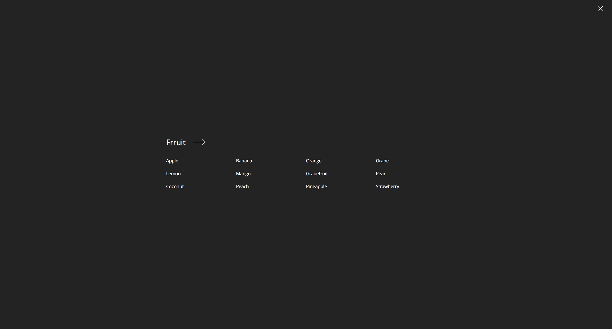

# chips.js


## Responsive fullscreen navigation menu



## Configuration

```javascript
$(element).chipsjs({
    dataType: 'html',
    animationIn: 'swing-in-top-fwd',
    animationOut: 'swing-out-top-fwd',
    animationDelay: 500,
    nav: '.chipsjs',
    ul: '.chipsjs__ul',
    li: '.chipsjs__li',
    ulNested: '.chipsjs__ul-nested',
    wrapper: '.chipsjs__wrapper',
    close: '.chipsjs__close',
    menu: '.chipsjs__menu',
    container: '.container',
    mediaQuery: 'all and (max-width:786px)',
    mobileTrigger: '.chipsjs__trigger',
    mobileReset: 'chipsjs__reset-transform',
    mobileSensitivity: 80,
    addTitle: true,
    appendHtml: '<div class="chipsjs__wrapper">' +
                '<button class="chipsjs__close"><span class="u-acc-hide">Close</span></button>' +
                '<div class="chipsjs__menu"><div class="container"></div></div></div>'
}
```
